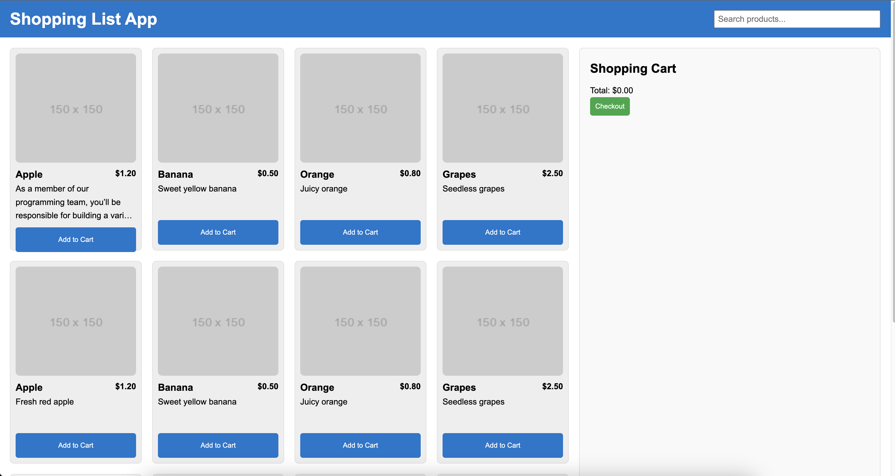

# Shopping List Application

A responsive web application for managing a shopping list. It features a dynamic product list, a shopping cart, and user-friendly interactions, ensuring accessibility and responsiveness across devices.


##  Current Status

The project is incomplete due to other priorities. Below is an outline of what has been implemented and the features that remain to be developed.

Implemented Features

	•	Product List:
	•	Displays products with images, names, prices, and descriptions.
	•	Responsive grid layout adapts to different screen sizes.
	•	Shopping Cart:
	•	Basic cart functionality: adding and removing items.
	•	Dynamically updates the total price.
	•	Search Bar:
	•	Responsive Design:
	•	Works on mobile, tablet, and desktop devices.

Pending Features

	•	Accessibility Enhancements:
	•	Add ARIA roles and improve keyboard navigation.
	•	Product Details:
	•	Create a dedicated view for detailed product information.
	•	Allows filtering of products by name.
	•	Checkout Process:
	•	Implement a form with validation for checkout.
	•	Code Cleanup:
	•	Add comments and improve modularity of the JavaScript code.

This file documents the current progress and serves as a roadmap for completing the project.

## Features

### Core Features
- **Product List**:
  - Displays products with images, names, prices, and descriptions.
  - Responsive grid layout adapts to different screen sizes.

- **Shopping Cart**:
  - Add and remove items from the cart.
  - Dynamically updates the total price.
  - Reflects changes immediately as items are added or removed.

- **User Interaction**:
  - Click on a product to view details or add it to the cart.
  - Simple and intuitive interface for managing the cart.

### Accessibility
- Implements ARIA roles and labels.
- Supports keyboard navigation for all interactive elements.

### Bonus Features
- Search bar to filter products by name.
- Responsive design for seamless use on mobile, tablet, and desktop devices.

---

## Screenshots

### **Product List**

---

## Technologies Used

- **Frontend**:
  - HTML5
  - CSS3 (Grid, Flexbox)
  - JavaScript (Vanilla)
---

## Getting Started

### Prerequisites
To run this application locally, ensure you have:
- A modern web browser (e.g., Chrome, Firefox, Edge).
- A text editor for code changes (optional).

### Installation

1. Clone the repository:
   ```bash
   git clone https://github.com/tekporlipos/shopping-list-app.git
   cd shopping-list-app
